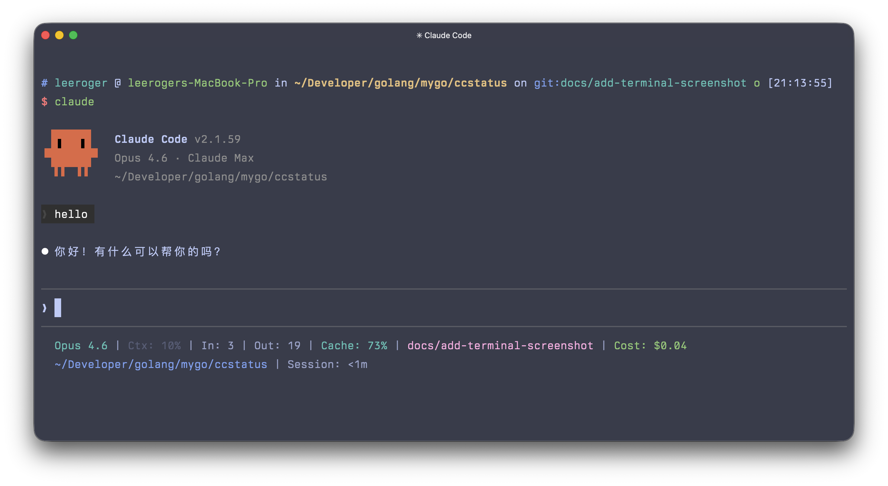

# ccstatus

[](https://github.com/moond4rk/ccstatus/actions/workflows/ci.yml)
[](https://codecov.io/gh/moond4rk/ccstatus)
[](https://pkg.go.dev/github.com/moond4rk/ccstatus)
[](https://goreportcard.com/report/github.com/moond4rk/ccstatus)
[](https://github.com/moond4rk/ccstatus/blob/main/LICENSE)

A customizable status line formatter for [Claude Code](https://code.claude.com/) CLI. Reads JSON session data from stdin, renders an ANSI-colored status line, and outputs to stdout.

<p align="center">
  
</p>

## Features

- Single static binary with no runtime dependencies
- 37 configurable widgets (model, tokens, context, git, cost, and more)
- Multi-line status line with flex separator layout
- ANSI 16-color support via [fatih/color](https://github.com/fatih/color)
- Configurable via `~/.config/ccstatus/settings.json`
- Automatic Claude Code integration via `install`/`uninstall` commands

## Installation

### Homebrew

```bash
brew install moond4rk/tap/ccstatus
```

### Go

```bash
go install github.com/moond4rk/ccstatus/cmd/ccstatus@latest
```

### Binary

Download a prebuilt binary from [GitHub Releases](https://github.com/moond4rk/ccstatus/releases).

> **Note:** ccstatus is a native Go binary and does not require Node.js. Unlike JS-based tools that use `npx`, ccstatus is best installed via Homebrew or `go install` for optimal performance.

## Quick Start

```bash
# Generate default settings
ccstatus init

# Register in Claude Code
ccstatus install
```

That's it. Claude Code will now display the status line after each assistant message.

## CLI Reference

```
ccstatus [flags]
ccstatus [command]
```

### Commands

| Command | Description |
|---------|-------------|
| `init` | Generate default `settings.json` at the ccstatus config directory |
| `install` | Register ccstatus as the status line command in Claude Code's `settings.json` |
| `uninstall` | Remove ccstatus status line configuration from Claude Code's `settings.json` |
| `validate` | Validate `settings.json` for correctness |
| `dump` | Save raw JSON input from Claude Code to a file for debugging |
| `widgets` | List all registered widget types with descriptions and default colors |
| `completion` | Generate shell autocompletion script (bash, zsh, fish, powershell) |

### Global Flags

| Flag | Description |
|------|-------------|
| `-h, --help` | Show help for any command |
| `-v, --version` | Print version |

### Command Details

#### `ccstatus init`

```bash
ccstatus init [--force]
```

Generates a default `settings.json` at `~/.config/ccstatus/settings.json`. Use `--force` to overwrite an existing file.

#### `ccstatus install`

```bash
ccstatus install
```

Registers ccstatus in Claude Code's `~/.claude/settings.json` (or `$CLAUDE_CONFIG_DIR/settings.json`) by adding:

```json
{
  "statusLine": {
    "type": "command",
    "command": "ccstatus",
    "padding": 0
  }
}
```

#### `ccstatus uninstall`

```bash
ccstatus uninstall
```

Removes the ccstatus status line configuration from Claude Code's settings.

#### `ccstatus validate`

```bash
ccstatus validate
```

Checks `settings.json` for errors such as unknown widget types, missing IDs, or invalid color names.

#### `ccstatus dump`

```bash
ccstatus dump [--output FILE]
```

Reads JSON from stdin (same as normal mode), saves it to a file, and renders the status line. Default output: `/tmp/ccstatus-dump.json`. Useful for inspecting what Claude Code sends.

#### `ccstatus widgets`

```bash
ccstatus widgets
```

Lists all registered widget types with their descriptions and default colors.

## Usage

```bash
# Default: read JSON from stdin, render status line
echo '{"model":{"id":"claude-opus-4-6","display_name":"Opus"}}' | ccstatus

# Replay captured dump data
cat /tmp/ccstatus-dump.json | ccstatus
```

## Configuration

Settings are stored at `~/.config/ccstatus/settings.json`. Edit manually to customize.

### Default Layout

The default configuration uses a 2-line layout:

**Line 1:** model | context % | input tokens | output tokens | cache hit rate | git branch | lines +/- | session cost

**Line 2:** working directory [flex space] session clock

### Settings Reference

```json
{
  "version": 4,
  "colorLevel": 2,
  "flexMode": "full-until-compact",
  "compactThreshold": 60,
  "defaultSeparator": "|",
  "defaultPadding": " ",
  "inheritSeparatorColors": false,
  "globalBold": false,
  "lines": [
    [
      {"id": "1", "type": "model", "color": "cyan"},
      {"id": "2", "type": "separator"},
      {"id": "3", "type": "context-percentage", "color": "brightBlack"}
    ]
  ]
}
```

### Global Settings

| Field | Type | Default | Description |
|-------|------|---------|-------------|
| `version` | int | `4` | Config schema version |
| `colorLevel` | int | `2` | Color level: `0` (none), `1` (basic), `2` (256-color terminal) |
| `flexMode` | string | `"full-until-compact"` | How flex separator calculates available width |
| `compactThreshold` | int | `60` | Context % threshold for switching to compact mode |
| `defaultSeparator` | string | `"\|"` | Separator character between widgets |
| `defaultPadding` | string | `" "` | Padding around separators |
| `inheritSeparatorColors` | bool | `false` | Separators inherit color from adjacent widget |
| `globalBold` | bool | `false` | Apply bold to all widgets |

### Widget Item Options

| Field | Type | Description |
|-------|------|-------------|
| `id` | string | Unique identifier |
| `type` | string | Widget type (see list below) |
| `color` | string | Foreground color name |
| `backgroundColor` | string | Background color name |
| `bold` | bool | Bold text |
| `prefix` | string | Text before widget output |
| `suffix` | string | Text after widget output |
| `character` | string | Special character (e.g., branch icon) |
| `rawValue` | bool | Use compact/raw output mode |
| `merge` | bool/string | Merge with adjacent widget (`true` or `"no-padding"`) |
| `metadata` | object | Widget-specific metadata |

### Flex Modes

| Mode | Description |
|------|-------------|
| `full` | Terminal width - 6 characters |
| `full-minus-40` | Terminal width - 40 characters |
| `full-until-compact` | Switch to -40 when context % >= compactThreshold (default) |

### Available Colors

8 basic: `black`, `red`, `green`, `yellow`, `blue`, `magenta`, `cyan`, `white`

8 bright: `brightBlack`, `brightRed`, `brightGreen`, `brightYellow`, `brightBlue`, `brightMagenta`, `brightCyan`, `brightWhite`

## Available Widgets

| Widget | Source | Description | Default Color |
|--------|--------|-------------|---------------|
| `model` | JSON | Current Claude model name | cyan |
| `version` | JSON | Claude Code version | white |
| `session-id` | JSON | Session ID (8-char short) | white |
| `session-cost` | JSON | Session cost in USD | green |
| `session-clock` | JSON | Session duration | white |
| `output-style` | JSON | Output style name | white |
| `git-branch` | Git | Current branch name | magenta |
| `git-changes` | Git | Uncommitted changes count | yellow |
| `git-worktree` | Git | Worktree name | magenta |
| `tokens-input` | JSON | Total input tokens | white |
| `tokens-output` | JSON | Total output tokens | white |
| `tokens-cached` | JSON | Cached tokens | white |
| `tokens-total` | JSON | Total tokens (in + out) | white |
| `current-usage-input` | JSON | Current round input tokens | white |
| `current-usage-output` | JSON | Current round output tokens | white |
| `cache-creation` | JSON | Cache creation tokens | white |
| `context-length` | JSON | Context usage in tokens | white |
| `context-percentage` | JSON | Context usage % | white |
| `context-percentage-usable` | JSON | Usable context % (80% of max) | white |
| `remaining-percentage` | JSON | Remaining context % | white |
| `cache-hit-rate` | JSON | Cache read ratio % | cyan |
| `api-duration` | JSON | API response time | white |
| `block-timer` | JSON/JSONL | 5-hour session block timer | white |
| `current-working-dir` | JSON | Current directory | blue |
| `project-dir` | JSON | Project root directory | blue |
| `transcript-path` | JSON | Transcript file path | white |
| `lines-changed` | Git | Lines changed (+N/-M) | green |
| `lines-added` | Git | Lines added | green |
| `lines-removed` | Git | Lines removed | red |
| `vim-mode` | JSON | Vim mode indicator | yellow |
| `agent-name` | JSON | Agent name | cyan |
| `exceeds-200k` | JSON | Warning at 200k tokens | red |
| `terminal-width` | System | Terminal width in columns | white |
| `custom-text` | - | User-defined static text | white |
| `custom-command` | System | Shell command output | white |
| `separator` | - | Visual separator | white |
| `flex-separator` | - | Fills remaining width | - |

## How It Works

Claude Code pipes JSON session data to stdin on each update (after assistant messages, permission changes, vim mode toggles). ccstatus parses the JSON, renders widgets according to the configured layout, and outputs ANSI-colored text to stdout.

```
Claude Code  --[JSON]--> ccstatus --[ANSI text]--> status line
```

For the full JSON schema, see the [official documentation](https://code.claude.com/docs/en/statusline).

## Debugging

Use `ccstatus dump` to capture the raw JSON that Claude Code sends:

```bash
# Temporarily switch to dump mode in ~/.claude/settings.json:
# "command": "ccstatus dump"

# Then inspect the captured data:
cat /tmp/ccstatus-dump.json | jq .

# Replay captured data to test rendering:
cat /tmp/ccstatus-dump.json | ccstatus
```

## References

- [Claude Code Status Line Documentation](https://code.claude.com/docs/en/statusline)
- [ccstatusline](https://github.com/sirmalloc/ccstatusline) - Original TypeScript implementation

## License

Apache License 2.0
