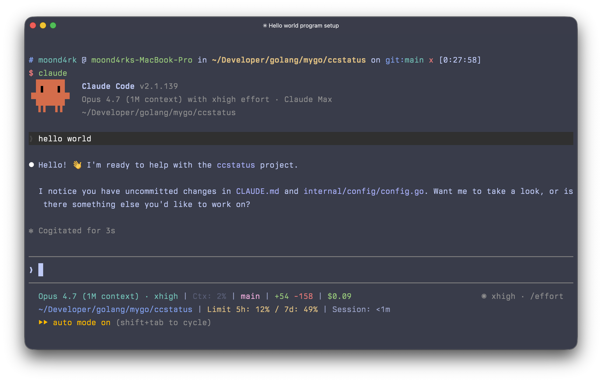

# ccstatus

[](https://github.com/moond4rk/ccstatus/actions/workflows/ci.yml) [](https://codecov.io/gh/moond4rk/ccstatus) [](https://pkg.go.dev/github.com/moond4rk/ccstatus) [](https://goreportcard.com/report/github.com/moond4rk/ccstatus) [](https://github.com/moond4rk/ccstatus/blob/main/LICENSE)

A customizable status line formatter for [Claude Code](https://code.claude.com/) CLI. Reads JSON session data from stdin, renders an ANSI-colored status line, and outputs to stdout.

<p align="center">
  
</p>

## Features

- Single static binary with no runtime dependencies
- 46 configurable widgets (model, tokens, context, git, cost, rate limits, and more)
- Multi-line status line with flex separator layout
- ANSI 16-color support via [fatih/color](https://github.com/fatih/color)
- Configurable via `~/.config/ccstatus/settings.json`
- Automatic Claude Code integration via `install`/`uninstall` commands

## Installation

### Homebrew

```bash
brew install moond4rk/tap/ccstatus
```

### Go

```bash
go install github.com/moond4rk/ccstatus/cmd/ccstatus@latest
```

## Quick Start

```bash
# Generate default settings
ccstatus init

# Register in Claude Code (re-run anytime to update; --refresh N / --hide-vim-indicator optional)
ccstatus install
```

That's it. Claude Code will now display the status line after each assistant message.

## CLI Reference

```
ccstatus [flags]
ccstatus [command]
```

### Commands

| Command | Description |
| --- | --- |
| `init` | Generate default `settings.json` at the ccstatus config directory |
| `install` | Register ccstatus as the status line command in Claude Code's `settings.json` |
| `uninstall` | Remove ccstatus status line configuration from Claude Code's `settings.json` |
| `validate` | Validate `settings.json` for correctness |
| `dump` | Save raw JSON input from Claude Code to a file for debugging |
| `widgets` | List all registered widget types with descriptions and default colors |
| `completion` | Generate shell autocompletion script (bash, zsh, fish, powershell) |

### Global Flags

| Flag            | Description               |
| --------------- | ------------------------- |
| `-h, --help`    | Show help for any command |
| `-v, --version` | Print version             |

### Command Details

#### `ccstatus init`

```bash
ccstatus init [--force]
```

Generates a default `settings.json` at `~/.config/ccstatus/settings.json`. Use `--force` to overwrite an existing file.

#### `ccstatus install`

```bash
ccstatus install
```

Registers ccstatus in Claude Code's `~/.claude/settings.json` (or `$CLAUDE_CONFIG_DIR/settings.json`) by adding:

```json
{
  "statusLine": {
    "type": "command",
    "command": "ccstatus",
    "padding": 0
  }
}
```

Optional flags:

- `--refresh N` — also re-run the status line every `N` seconds (writes `refreshInterval`). Useful when you use time-based widgets (`session-clock`, `block-timer`, `api-duration`) or git widgets that change while a background subagent works. Omit to run only on Claude Code's events.
- `--hide-vim-indicator` — suppress Claude Code's built-in `-- INSERT --` line (writes `hideVimModeIndicator`). Set this if you use the `vim-mode` widget so the mode isn't shown twice.

#### `ccstatus uninstall`

```bash
ccstatus uninstall
```

Removes the ccstatus status line configuration from Claude Code's settings.

#### `ccstatus validate`

```bash
ccstatus validate
```

Checks `settings.json` for unknown widget types, missing or duplicate widget IDs, and invalid color names. Exits non-zero when any problem is found, so it works as a CI gate.

#### `ccstatus dump`

```bash
ccstatus dump [--output FILE]
```

Reads JSON from stdin (same as normal mode), saves it to a file, and renders the status line. Default output: `/tmp/ccstatus-dump.json`. Useful for inspecting what Claude Code sends.

#### `ccstatus widgets`

```bash
ccstatus widgets
```

Lists all registered widget types with their descriptions and default colors.

## Usage

```bash
# Default: read JSON from stdin, render status line
echo '{"model":{"id":"claude-opus-4-7","display_name":"Opus"}}' | ccstatus

# Replay captured dump data
cat /tmp/ccstatus-dump.json | ccstatus
```

## Configuration

Settings are stored at `~/.config/ccstatus/settings.json`. Edit manually to customize.

### Default Layout

A lean 2-line layout. Widgets with nothing to show — `effort`, `git-worktree`, `rate-limits` — are dropped, so a plain session collapses to `model | Ctx% | branch | +/- | $` over `cwd | Session`.

**Line 1:** `model · effort | context % | git branch + worktree | lines +/- | session cost`

**Line 2:** `working directory | rate limits (5h/7d) | session clock`

```
Opus 4.7 (1M context) · max | Ctx: 36% | main feat-x | +12 -3 | $0.34
~/dev/myproj | Limit 5h: 3% / 7d: 12% | Session: 2h15m

Sonnet | Ctx: 12% | main | +4 | $0.05
~/dev/myproj | Session: 30m
```

To customize, edit the `lines` array in `settings.json` — e.g. swap `rate-limits` for the per-window `rate-limit-5h` (`metadata.display`: `bar`/`reset`/`full`), or add `cache-hit-rate`. (If line 1 is getting truncated with `...`, see `terminalWidth` below.)

### Settings Reference

```json
{
  "version": 4,
  "colorLevel": 2,
  "flexMode": "full-until-compact",
  "compactThreshold": 90,
  "defaultSeparator": "|",
  "defaultPadding": " ",
  "inheritSeparatorColors": false,
  "globalBold": false,
  "lines": [
    [
      { "id": "1", "type": "model", "color": "cyan" },
      { "id": "2", "type": "separator" },
      { "id": "3", "type": "context-percentage", "color": "brightBlack" }
    ]
  ]
}
```

### Global Settings

| Field | Type | Default | Description |
| --- | --- | --- | --- |
| `version` | int | `4` | Config schema version |
| `colorLevel` | int | `2` | `0` disables color; any value `>= 1` enables ANSI 16-color output |
| `flexMode` | string | `"full-until-compact"` | How flex separator calculates available width |
| `compactThreshold` | int | `90` | Context % at which `full-until-compact` switches to the wider (−40 col) right margin |
| `terminalWidth` | int | (auto) | Force the status line width in columns. Claude Code runs the status line command with stdio piped, so width auto-detection often falls back to 80 regardless of terminal size — set this (e.g. `180`) to make ccstatus use your real width. Leave unset/`0` to auto-detect. |
| `defaultSeparator` | string | `"\|"` | Separator character between widgets |
| `defaultPadding` | string | `" "` | Padding around separators |
| `inheritSeparatorColors` | bool | `false` | Separators inherit color from adjacent widget |
| `globalBold` | bool | `false` | Apply bold to all widgets |

### Widget Item Options

| Field | Type | Description |
| --- | --- | --- |
| `id` | string | Unique identifier |
| `type` | string | Widget type (see list below) |
| `color` | string | Foreground color name |
| `backgroundColor` | string | Background color name |
| `bold` | bool | Bold text |
| `prefix` | string | Text before widget output |
| `suffix` | string | Text after widget output |
| `character` | string | Special character (e.g., branch icon) |
| `rawValue` | bool | Use compact/raw output mode |
| `merge` | bool/string | Merge with adjacent widget (`true` or `"no-padding"`) |
| `metadata` | object | Widget-specific metadata |

### Flex Modes

| Mode | Description |
| --- | --- |
| `full` | Terminal width - 10 characters |
| `full-minus-40` | Terminal width - 40 characters |
| `full-until-compact` | Terminal width - 10, switching to - 40 once context % >= `compactThreshold` (default) |

### Available Colors

8 basic: `black`, `red`, `green`, `yellow`, `blue`, `magenta`, `cyan`, `white`

8 bright: `brightBlack`, `brightRed`, `brightGreen`, `brightYellow`, `brightBlue`, `brightMagenta`, `brightCyan`, `brightWhite`

## Available Widgets

| Widget | Source | Description | Default Color |
| --- | --- | --- | --- |
| `model` | JSON | Current Claude model name | cyan |
| `version` | JSON | Claude Code version | white |
| `session-id` | JSON | Session ID (8-char short) | white |
| `session-name` | JSON | Custom session name (`--name` / `/rename`) | white |
| `session-cost` | JSON | Session cost in USD | green |
| `session-clock` | JSON | Session duration | white |
| `output-style` | JSON | Output style name | white |
| `git-branch` | Git | Current branch name | magenta |
| `git-changes` | Git | Uncommitted changes count | yellow |
| `git-worktree` | Git | Worktree name | magenta |
| `tokens-input` | JSON | Input tokens in current context, incl. cache (~= `context-length` since CC v2.1.132) | white |
| `tokens-output` | JSON | Output tokens from the most recent API response | white |
| `tokens-cached` | JSON | Cached tokens | white |
| `tokens-total` | JSON | Tokens currently in the context window (in + out) | white |
| `current-usage-input` | JSON | Current round input tokens | white |
| `current-usage-output` | JSON | Current round output tokens | white |
| `cache-creation` | JSON | Cache creation tokens | white |
| `context-length` | JSON | Context usage in tokens | white |
| `context-percentage` | JSON | Context usage % | white |
| `context-percentage-usable` | JSON | Usable context % (heuristic: 80% of max, leaving auto-compact headroom) | white |
| `remaining-percentage` | JSON | Remaining context % | white |
| `cache-hit-rate` | JSON | Cache read ratio % | cyan |
| `api-duration` | JSON | API response time | white |
| `block-timer` | JSON/JSONL | 5-hour block timer (uses the rate-limit window when available) | white |
| `rate-limits` | JSON | Combined 5h/7d rate-limit usage, e.g. `5h: 3% / 7d: 12%` (each shown only when present) | yellow |
| `rate-limit-5h` | JSON | 5-hour rate-limit usage (`metadata.display`: `percent`/`bar`/`reset`/`full`; `metadata.barWidth`) | yellow |
| `rate-limit-7d` | JSON | 7-day rate-limit usage (`metadata.display`: `percent`/`bar`/`reset`/`full`; `metadata.barWidth`) | yellow |
| `current-working-dir` | JSON | Current directory | blue |
| `project-dir` | JSON | Project root directory | blue |
| `transcript-path` | JSON | Transcript file path | white |
| `added-dirs` | JSON | Directories added via `/add-dir` (`metadata.display`: `list` for names) | blue |
| `repo` | JSON | Repository `owner/name` from the origin remote (raw: name only) | blue |
| `pr` | JSON | Open PR number + review state, e.g. `#1234 approved` (raw: number) | cyan |
| `lines-changed` | Git | Lines changed (+N/-M) | green |
| `lines-added` | Git | Lines added | green |
| `lines-removed` | Git | Lines removed | red |
| `vim-mode` | JSON | Vim mode indicator | yellow |
| `agent-name` | JSON | Agent name | cyan |
| `effort` | JSON | Reasoning effort level | cyan |
| `thinking` | JSON | Extended thinking indicator | magenta |
| `exceeds-200k` | JSON | Warning at 200k tokens | red |
| `terminal-width` | System | Terminal width in columns | white |
| `custom-text` | - | User-defined static text | white |
| `custom-command` | System | Shell command output | white |
| `separator` | - | Visual separator | white |
| `flex-separator` | - | Fills remaining width | - |

## How It Works

Claude Code pipes JSON session data to stdin on each update (after assistant messages, permission changes, vim mode toggles). ccstatus parses the JSON, renders widgets according to the configured layout, and outputs ANSI-colored text to stdout.

```
Claude Code  --[JSON]--> ccstatus --[ANSI text]--> status line
```

For the full JSON schema, see the [official documentation](https://code.claude.com/docs/en/statusline).

> **Not yet supported:** the separate [`subagentStatusLine`](https://code.claude.com/docs/en/statusline#subagent-status-lines) setting (a per-subagent row in the agent panel) has a different input/output contract and is tracked for a future release.

## Debugging

Use `ccstatus dump` to capture the raw JSON that Claude Code sends:

```bash
# Temporarily switch to dump mode in ~/.claude/settings.json:
# "command": "ccstatus dump"

# Then inspect the captured data:
cat /tmp/ccstatus-dump.json | jq .

# Replay captured data to test rendering:
cat /tmp/ccstatus-dump.json | ccstatus
```

## References

- [Claude Code Status Line Documentation](https://code.claude.com/docs/en/statusline)
- [ccstatusline](https://github.com/sirmalloc/ccstatusline) - Original TypeScript implementation

## License

Apache License 2.0
